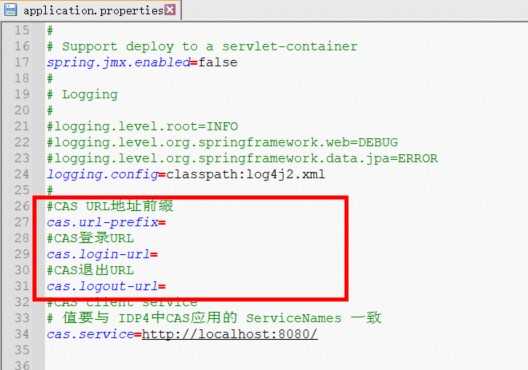

# idp4-application-cas-demo
cas client应用插件demo。

## 开发环境要求
- Java  v1.8+
- Maven 3.3+
- 字符编码：UTF-8

## 使用框架与版本
- cas-client-core  v3.4.1
- Spring-boot  v2.7.8

## 文件清单
1. idp4-application-cas-demo.war
2. application.properties

## 如何使用

### 1. 前提
本DEMO环境依赖于JDK 1.8，请先提前安装   
修改配置文件：application.properties (主要是cas相关)

1. 在IDaaS中以IT管理员登录，进入'添加应用'，搜索 cas 关键字，查找到 CAS(标准) 应用，并点击'添加应用'，在 ServiceNames 中填入 http://localhost:8080/ （同配置文件application.properties中的 cas.service  ）
2. 在 TargetUrl中也填入 http://localhost:8080/ 并提交应用。
3. 在弹出的选择框中点击'立即授权'进去 搜索需要进行登录的账户进行授权。
4. 在左侧菜单中进入'应用列表' 找到刚创建的应用，点击'详情'->'查看详情' 可看到详情内容，如下图：

- CAS Login URL，CAS登录URL
- CAS Logout URL，CAS退出URL
- CAS Server URL Prefix，CAS URL地址前缀

复制准备好以上信息，需要在下一步中配置到idp4-application-cas-demo中。

5. 修改application.properties,依次找到并填入以上url  

### 2.启动

使用java -jar启动程序：
> java -jar idp4-application-cas-demo.war

访问 {host}/   如: http://localhost:8080/  
会自动跳转到IDaaS进行cas认证

## 更多帮助
- 查看更多关于[CAS协议](https://www.apereo.org/projects/cas)的信息。

