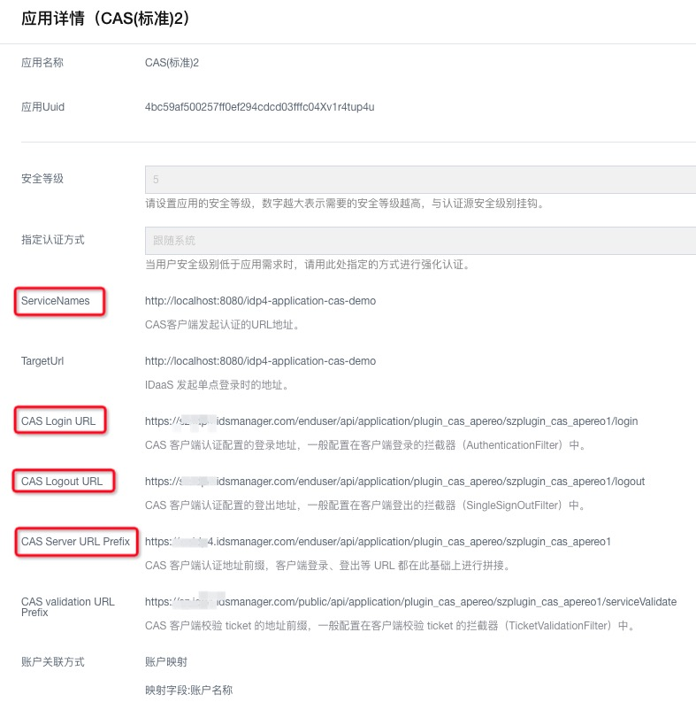
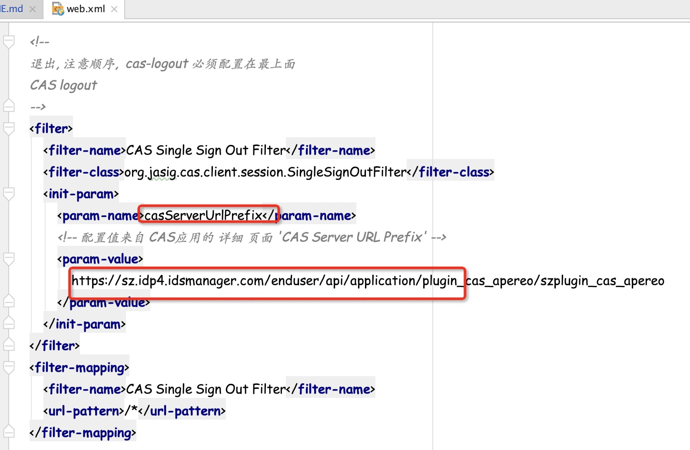
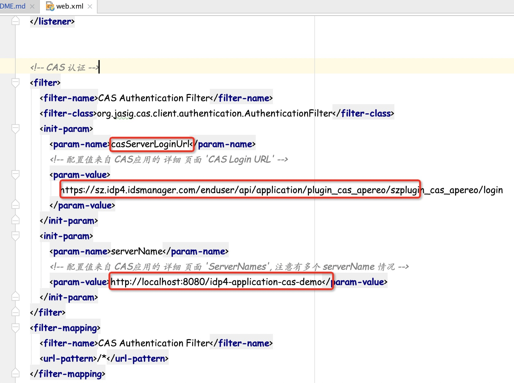
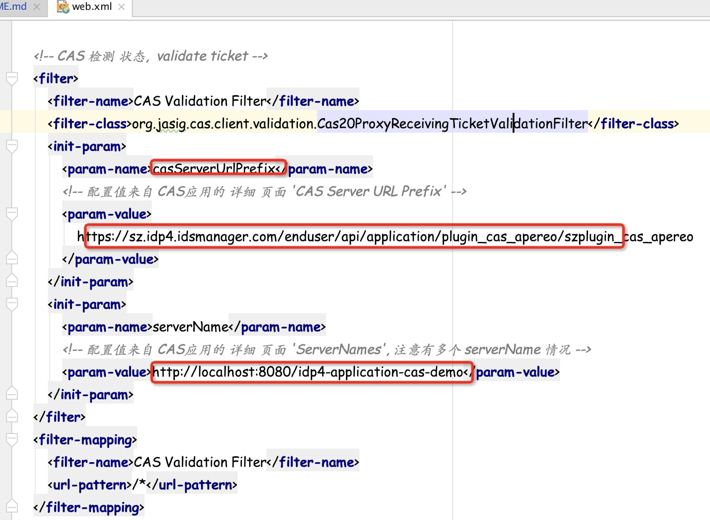

# idp4-application-cas-demo
cas client应用插件demo。

## 开发环境要求
- Java  v1.8+
- Maven 3.3+
- 字符编码：UTF-8

## 使用框架与版本
- cas-client-core  v3.4.1
- Spring  v4.1.6.RELEASE
- slf4j-log4j  v1.7.21

## 如何使用
> 前提：需要有部署IDaaS（IDP4）的实例。
1. clone工程到本地开发环境（需要安装Maven, JDK）。
2. 使用IDE打开工程，添加Tomcat运行环境，配置端口 8080，contextPath为 idp4-application-cas-demo （浏览器访问地址为：http://localhost:8080/idp4-application-cas-demo）

> http://localhost:8080/idp4-application-cas-demo 为CAS serviceNames。

3. 在IDP4中以IT管理员登录，进入'添加应用'，搜索 cas 关键字，查找到 CAS(标准) 应用，并点击'添加应用'，在 ServiceNames 中填入 http://localhost:8080/idp4-application-cas-demo；
在 TargetUrl中也填入 http://localhost:8080/idp4-application-cas-demo  并提交应用。
4. 在弹出的选择框中点击'立即授权'进去 搜索需要进行登录的账户进行授权。
5. 在左侧菜单中进入'应用列表' 找到刚创建的应用，点击'详情'->'查看详情' 可看到详情内容，如下图：

- CAS Login URL，CAS登录URL
- CAS Logout URL，CAS退出URL
- CAS Server URL Prefix，CAS URL地址前缀

复制准备好以上信息，需要在下一步中配置到idp4-application-cas-demo中。

6. 打开 src/main/resources目录中 [cas-client.properties](src/main/resources/cas-client.properties) 文件，将 CAS Logout URL 复制配置在里面（property: cas.logout.url）。
7. 打开 src/main/webapp/WEB-INF/[web.xml](src/main/webapp/WEB-INF/web.xml) 文件，根据里面提示，依次配置里面的

**CAS Single Sign Out Filter**

**CAS Authentication Filter**

**CAS Validation Filter**。

8. 部署工程并启动Tomcat，访问 http://localhost:8080/idp4-application-cas-demo 即可。
   

## 更多帮助
- 查看更多关于[CAS协议](https://www.apereo.org/projects/cas)的信息。

